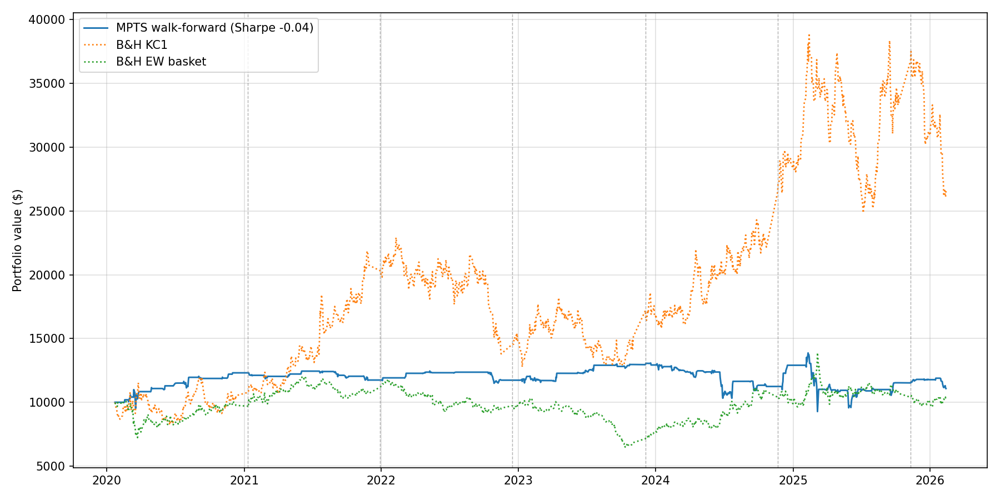
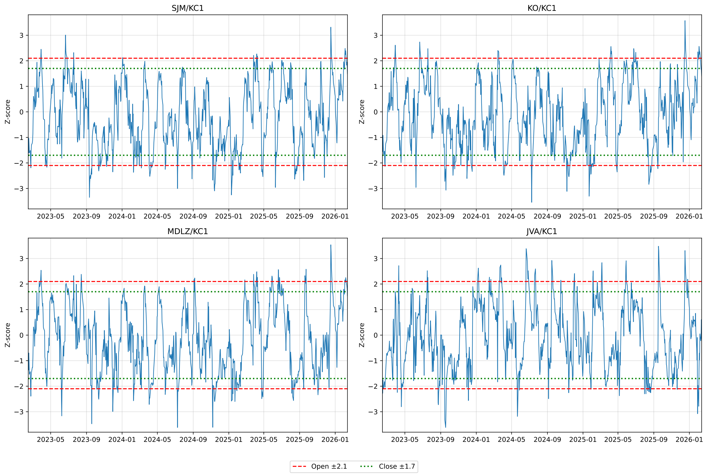

# Multivariate Pairs Trading on the Coffee Market

**Market-neutral statistical arbitrage between Arabica coffee futures (KC1) and a basket of coffee value-chain equities, with convex-optimized position sizing and a beta-neutrality constraint.**


## Project context

This began as the final project of the *Commodities Markets and Models* course (MSc Financial Engineering, ESILV Paris, March 2026). The assignment: each student was **assigned a commodity — coffee, in my case — and a reference paper to replicate** on it. Mine was the *Optimal Trading Technique* of [Yang & Malik (2024)](https://doi.org/10.3390/ijfs12030077), originally designed for cryptocurrency/fiat pairs, transposed here onto a structurally harder asset class: soft commodities. The original write-up is in [`reports/Multivariate_Pair_Trading.pdf`](reports/Multivariate_Pair_Trading.pdf).

The repository is the course project refactored into a reproducible research package, plus a few extensions added afterwards:

- **rolling-window walk-forward validation** replacing the report's single 70/30 split (every parameter is re-estimated per fold on a fixed-length calibration window and only ever judged on unseen data);
- a modular `src/` package with unit tests, an open-source solver fallback next to Gurobi, and a free-data reproduction path;
- a signal-timing bug found and fixed during the refactor (entries were booking the same-day move that triggered them — see the commit history).

**The strategy:** instead of trading a single spread, monitor a basket of spreads between the Arabica front-month future (KC1) and four coffee value-chain equities (SJM, KO, MDLZ, JVA); each day a bi-objective convex optimizer sizes the triggered positions, balancing expected profit against λ-weighted variance under no-leverage and beta-neutrality constraints.

> **An honest disclaimer up front:** across six years of walk-forward test windows the strategy does not beat a buy-and-hold of the coffee future, and the binding constraint is statistical, not methodological — see [the main limitation](#the-main-statistical-limitation) below. The framework's machinery (optimizer, dynamic hedge, volatility compression) works as designed; the value of the project is the rigor of that diagnosis.

---

## Results at a glance

**Rolling walk-forward validation** on the Bloomberg dataset: 7 folds, each calibrated on a fixed 4-year window and traded on the following 12 months, stitched out-of-sample window Jan 2020 → Feb 2026 (~6 years of test data), $10,000 initial capital, 10 bps transaction costs per leg, Gurobi solver. Every number below comes from test windows the calibration never saw.

| Metric | MPTS walk-forward | B&H KC1 | B&H EW basket |
|---|---|---|---|
| Sharpe ratio | −0.04 | 0.53 | −0.03 |
| Annualized return | 1.8% | 18.5% | 0.7% |
| Annualized volatility | **17.3%** | 37.7% | 22.8% |
| Max drawdown | **−33.1%** | −44.3% | −46.1% |
| Trades | 236 (52% winners) | — | — |



Per-fold diagnostics (thresholds re-calibrated on each rolling calibration window — the plateau of the grid search, not the argmax):

| Fold | Test window | Thresholds (open/close) | Trades | Sharpe |
|---|---|---|---|---|
| 1 | Jan 2020 – Dec 2020 | ±2.1 / ±1.0 | 39 | **+1.18** |
| 2 | Jan 2021 – Nov 2021 | ±2.2 / ±0.7 | 29 | −1.55 |
| 3 | Dec 2021 – Nov 2022 | ±2.2 / ±0.6 | 27 | −0.71 |
| 4 | Dec 2022 – Nov 2023 | ±2.1 / ±0.7 | 32 | **+0.84** |
| 5 | Dec 2023 – Oct 2024 | ±1.9 / ±0.9 | 38 | −1.00 |
| 6 | Nov 2024 – Oct 2025 | ±1.7 / ±0.6 | 44 | +0.13 |
| 7 | Nov 2025 – Feb 2026 (short) | ±1.2 / ±1.0 | 27 | −2.33 |

Median fold Sharpe **−0.71**, range **[−2.33, +1.18]**.

**The honest reading.** The rolling calibration does what it is meant to do — the thresholds visibly adapt as the volatile post-2021 regime enters the estimation window (entry bands tighten from ±2.1 to ±1.2 by the final fold) — and the market-neutral machinery keeps volatility below half of the KC1 benchmark's with a smaller drawdown. What the adaptation cannot do is manufacture an edge: fold-level Sharpe flips sign repeatedly and the aggregate is indistinguishable from zero. That is the expected outcome given [the statistical limitation below](#the-main-statistical-limitation) — mean reversion cannot be traded profitably where cointegration is absent — and it is precisely the conclusion a single favorable split can hide. The original single-split study is preserved in [`reports/Multivariate_Pair_Trading.pdf`](reports/Multivariate_Pair_Trading.pdf).

---

## Methodology

**Pipeline** (every estimate is computed on data strictly prior to the window it is used in):

1. **Universe screening** — daily closes 2016–2026 for KC1, 6 sector ETFs and 17 coffee value-chain equities → log-prices → ADF unit-root test (require I(1)) → Engle-Granger cointegration against KC1 → select the 4 most cointegrated names. Screening uses only the first calibration window.
2. **Rolling walk-forward validation** — each fold estimates all parameters on a fixed-length 4-year calibration window, trades the following 12 months out-of-sample (1-month embargo in between, forced liquidation at fold boundaries), then the window slides forward by one test window, dropping the oldest data. *Why rolling rather than expanding:* the sample splits into structurally different regimes (range-bound 2016–2019, supply-shock trends from 2021 on); an expanding window would let stale early-regime threshold economics dominate every later calibration — the regime-mismatch failure the original study diagnosed. Rolling keeps the estimation sample representative of current dynamics and its size constant across folds; the trade-off is fewer observations per calibration (noisier estimates), mitigated by the plateau selection in step 3. Only stitched test-fold performance is ever reported.
3. **Signals** — 22-day rolling z-score of each log-spread; open when |z| breaches the entry band, close on reversion. Thresholds come from a per-fold grid search (open ∈ [1, 2.5), close ∈ [0.5, 2.0), close < open enforced) maximizing the average Sharpe across the basket; to curb per-fold selection bias, the strategy uses the **median of the top decile of the grid** (the plateau) rather than the argmax cell.
4. **Hedging** — each equity's coffee sensitivity β<sub>i,KC1</sub> is isolated via multivariate OLS on KC1 **and** the consumer-staples ETF (XLP), estimated on a 252-day rolling window (causal by construction) and locked at trade entry.
5. **Position sizing** — every day with triggered signals, solve:

$$\max_{W}\; \sum_n W_n \cdot (EP_n \odot [1,-1])^{\prime} \;-\; \lambda \sum_n W_n\, \tilde{\Sigma}_n\, W_n^{\prime}$$

$$\text{s.t.}\quad 0 \le W_{long} \le 1,\quad -1 \le W_{short} \le 0,\quad \sum_n (W_{long} - W_{short}) \le \text{capital},\quad \sum_e \beta_{e}\,(W_{long}+W_{short}) = 0$$

   where the expected profit *EP* combines train-window mean returns with a mean-reversion-speed proxy (average round-trip holding time), and Σ̃ is the pair covariance with sign-flipped off-diagonals. Solved with **Gurobi** (original study) or an open-source **SciPy SLSQP** fallback so anyone can run it.
6. **Backtest** — daily simulation over each test fold with mark-to-market, per-leg transaction costs, capital recycling, trade logging and forced liquidation at fold boundaries; benchmarked against KC1 buy-and-hold and an equally weighted equity basket over the same stitched period.

<p align="center">

</p>

---

## Repository structure

```
multivariate-pairs-coffee/
├── README.md
├── configs/
│   ├── default.yaml            # every parameter of the pipeline (Yahoo data)
│   └── bloomberg.yaml          # same pipeline on the original Bloomberg export
├── data/
│   ├── README.md               # data sources, schema, Bloomberg disclaimer
│   └── raw/                    # git-ignored (proprietary / re-downloadable)
├── notebooks/
│   ├── 01_statistical_screening.ipynb   # EDA, ADF, Engle-Granger, basket selection
│   └── 02_backtest_analysis.ipynb       # calibration, backtest, benchmarks
├── scripts/
│   ├── download_data.py        # free Yahoo Finance universe builder
│   └── run_backtest.py         # one-command end-to-end pipeline
├── src/
│   ├── data.py                 # loaders (Bloomberg xlsx / Yahoo csv), screening window
│   ├── stat_tests.py           # ADF and Engle-Granger screening
│   ├── signals.py              # z-scores, threshold grid search, reversion speed
│   ├── hedging.py              # static & rolling multivariate betas, covariances
│   ├── optimizer.py            # bi-objective allocation (Gurobi + SciPy backends)
│   ├── backtest.py             # daily simulation engine, trade log, benchmarks
│   ├── walk_forward.py         # rolling folds, plateau calibration, WF runner
│   └── metrics.py              # Sharpe, drawdown, trade-level statistics
├── tests/                      # pytest unit tests (no license, no network needed)
├── reports/
│   ├── Multivariate_Pair_Trading.pdf    # full write-up
│   └── figures/                # figures from the original Bloomberg run
├── requirements.txt
└── LICENSE
```

## Quick start

```bash
git clone https://github.com/Edoardovona/multivariate-pairs-coffee.git
cd multivariate-pairs-coffee
pip install -r requirements.txt

python scripts/download_data.py      # free Yahoo Finance data → data/raw/prices.csv
python scripts/run_backtest.py       # screening → calibration → backtest → report
```

With the original Bloomberg export (see [A note on data](#a-note-on-data)):

```bash
# place the export at data/raw/CoffeeData.xlsx, then
python scripts/run_backtest.py --config configs/bloomberg.yaml
```

Run the tests:

```bash
pytest tests/ -v
```

Every parameter (universe, walk-forward fold structure, λ, transaction costs, solver) lives in [`configs/default.yaml`](configs/default.yaml).

## A note on data

The study was conducted on a **Bloomberg** daily dataset (Feb 2016 – Feb 2026; 2,610 rows × 25 assets). Bloomberg data is proprietary and licensed, so the file is **git-ignored and not distributed** — it lives only in the author's local copy at `data/raw/CoffeeData.xlsx` and is consumed via [`configs/bloomberg.yaml`](configs/bloomberg.yaml).

So that anyone cloning this repository can still run the pipeline end-to-end, `scripts/download_data.py` rebuilds a comparable universe from **free Yahoo Finance data** (`KC=F` for the Arabica future), which the default config points at. Futures roll methodology, adjustments and listing coverage differ between the two sources, so expect qualitatively similar behaviour rather than the exact reported figures. Details in [`data/README.md`](data/README.md).

For reference, a validation run on the free Yahoo dataset reproduces the study's qualitative findings: SJM is the only candidate cointegrated with KC1 at the 5% level, the strategy compresses volatility to roughly half of the KC1 benchmark's, and performance remains highly sensitive to the threshold configuration.

## The main statistical limitation

**There is essentially no cointegration within the assigned equity basket — and this is a constraint of the assigned universe, not of the methodology.** In the screening window only SJM is cointegrated with KC1 at the 5% level; the other candidates show Engle-Granger p-values between 0.22 and 0.53. The economics are intuitive: large consumer-staples companies (Coca-Cola, Mondelēz) have the pricing power to pass coffee input costs through to consumers, which severs the long-run equilibrium between their equity prices and the commodity. Pairs trading exploits mean reversion, and mean reversion requires a stable long-run relationship — no optimizer, hedge or calibration scheme can manufacture one that is statistically absent.

**The acknowledged simple alternative:** trading the **Arabica–Robusta spread (KC1 vs DF1)** directly. The two coffee qualities are economically bound by substitution in roasters' blends, making them a far more natural cointegrated pair than any coffee-adjacent equity. The course assignment was to replicate the multivariate equity-basket framework of the reference paper on the assigned commodity, which is what this repository does — the inter-commodity spread is the obvious next experiment and is listed in the extensions below.

## Other findings

- **Threshold economics are regime-dependent.** The per-fold calibrations drift as the sample grows and the volatility regime shifts — visible directly in the fold table above. This is precisely what a single-split design cannot reveal, and why the walk-forward structure replaced it.
- **Risk control works.** The beta-neutrality constraint and variance penalty compress volatility to a fraction of the KC1 benchmark's and roughly halve the drawdown, across data sources and configurations.
- **Transaction-cost sensitivity is moderate** at daily frequency (multi-day average holding), unlike the intraday original study where costs accumulate over thousands of trades.

## Possible extensions

- **Arabica–Robusta (KC1/DF1) inter-commodity spread** — the natural cointegrated pair, per the limitation above.
- Kalman-filter time-varying hedge ratio instead of static Engle-Granger betas.
- Johansen cointegration on the full basket rather than pairwise tests.
- Volatility-adaptive thresholds (bands scaled by short- vs long-run spread volatility) to react to regime shifts between fold recalibrations.
- Broader universe: FX of producer countries (BRL, VND), cross-exchange spreads.
- Deflated Sharpe ratio / probability of backtest overfitting on the fold results.

## References

- Yang, H. & Malik, A. (2024). *Optimal Market-Neutral Multivariate Pair Trading on the Cryptocurrency Platform*. International Journal of Financial Studies, 12(3):77.
- Silveira, Mattos & Saes (2017). *The Reaction of Coffee Futures Price Volatility to Crop Reports*. Emerging Markets Finance and Trade, 53(10).
- Geman, H. (2014). *Agricultural Finance: from Crops to Land, Water and Infrastructure*. Wiley.

## Author

**Edoardo Vona** — MSc Financial Engineering, ESILV Paris.
