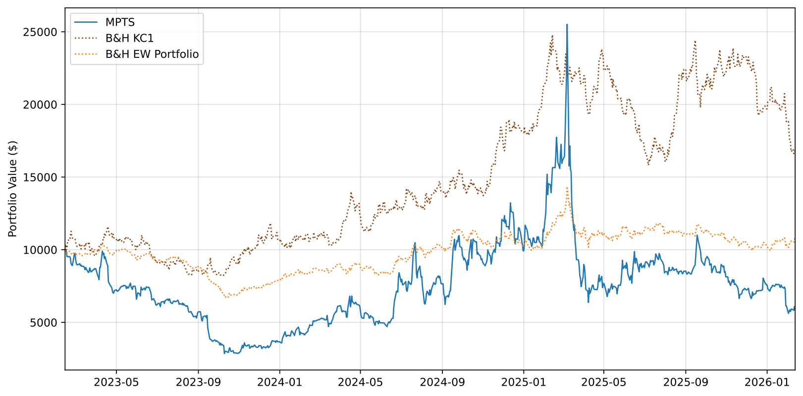

# Multivariate Pairs Trading on the Coffee Market

**Market-neutral statistical arbitrage between Arabica coffee futures (KC1) and a basket of coffee value-chain equities, with convex-optimized position sizing and a beta-neutrality constraint.**


This project adapts the *Optimal Trading Technique* of [Yang & Malik (2024)](https://doi.org/10.3390/ijfs12030077) — originally designed for cryptocurrency/fiat pairs — to a structurally harder asset class: **soft commodities**. Instead of trading a single spread, the strategy monitors a basket of spreads between the Arabica front-month future and four consumer-staples equities (SJM, KO, MDLZ, JVA), and each day a bi-objective convex optimizer sizes the triggered positions, balancing expected profit against λ-weighted variance under no-leverage and beta-neutrality constraints.

The full write-up is in [`reports/Multivariate_Pair_Trading.pdf`](reports/Multivariate_Pair_Trading.pdf).

> **An honest disclaimer up front:** the headline result is *negative* — the in-sample-optimized configuration loses to buy-and-hold in the 2023–2026 coffee bull market. The project's value lies in the diagnosis: the framework's machinery (optimizer, dynamic hedge, risk compression) worked exactly as designed, while the statistical foundation (cointegration) and the threshold calibration regime did not survive out-of-sample. Negative results, documented rigorously, are still results.

---

## Results at a glance

Out-of-sample window: Feb 2023 → Feb 2026 (783 trading days), $10,000 initial capital, 10 bps transaction costs per leg.

| Metric | B&H KC1 | B&H EW basket | MPTS (IS-opt ±2.1/±1.7) | MPTS (manual ±1.0/±0.6)* |
|---|---|---|---|---|
| Sharpe ratio | 0.543 | 0.038 | **−0.165** | 0.349 |
| Annualized return | 18.45% | 2.18% | 1.48% | 9.50% |
| Annualized volatility | 35.69% | 23.02% | **11.17%** | 20.97% |
| Max drawdown | −36.19% | −35.41% | **−19.99%** | −30.46% |
| Trades (3 years) | — | — | 116 | 248 |

\* *Exploratory configuration with look-ahead — shown to demonstrate that the failure mode is threshold regime mismatch, not the optimization machinery.*



**What worked:** volatility compressed to a third of the benchmark's, the rolling β-hedge neutralized commodity exposure daily, and the Gurobi allocation sized positions across the basket as intended.

**What didn't, and why:** (1) three of the four pairs are not cointegrated at the 5% level — large-cap staples pass coffee input costs through to consumers, severing the long-run link with the commodity; (2) thresholds calibrated on the moderate-volatility 2016–2023 regime rarely triggered during the explosive OOS run, starving the optimizer of signals.

---

## Methodology

**Pipeline** (all calibration strictly in-sample; 70/30 chronological split, no look-ahead):

1. **Universe screening** — daily closes 2016–2026 for KC1, 6 sector ETFs and 17 coffee value-chain equities → log-prices → ADF unit-root test (require I(1)) → Engle-Granger cointegration against KC1 → select the 4 most cointegrated names.
2. **Signals** — 22-day rolling z-score of each log-spread; open when |z| breaches the entry band, close on reversion. Entry/exit thresholds calibrated by an in-sample grid search maximizing the average Sharpe (open ∈ [1, 2.5), close ∈ [0.5, 2.0), close < open enforced).
3. **Hedging** — each equity's coffee sensitivity β<sub>i,KC1</sub> is isolated via multivariate OLS on KC1 **and** the consumer-staples ETF (XLP), estimated on a 252-day rolling window and locked at trade entry.
4. **Position sizing** — every day with triggered signals, solve:

$$\max_{W}\; \sum_n W_n \cdot (EP_n \odot [1,-1])^{\prime} \;-\; \lambda \sum_n W_n\, \tilde{\Sigma}_n\, W_n^{\prime}$$

$$\text{s.t.}\quad 0 \le W_{long} \le 1,\quad -1 \le W_{short} \le 0,\quad \sum_n (W_{long} - W_{short}) \le \text{capital},\quad \sum_e \beta_{e}\,(W_{long}+W_{short}) = 0$$

   where the expected profit *EP* combines in-sample mean returns with a mean-reversion-speed proxy (average round-trip holding time), and Σ̃ is the pair covariance with sign-flipped off-diagonals. Solved with **Gurobi** (original study) or an open-source **SciPy SLSQP** fallback (this repo, so anyone can run it).
5. **Backtest** — daily OOS simulation with mark-to-market, per-leg transaction costs, capital recycling and trade logging; benchmarked against KC1 buy-and-hold and an equally weighted equity basket.

<p align="center">

</p>

---

## Repository structure

```
multivariate-pairs-coffee/
├── README.md
├── configs/
│   └── default.yaml            # every parameter of the pipeline in one place
├── data/
│   ├── README.md               # data sources, schema, Bloomberg disclaimer
│   └── raw/                    # git-ignored (proprietary / re-downloadable)
├── notebooks/
│   ├── 01_statistical_screening.ipynb   # EDA, ADF, Engle-Granger, basket selection
│   └── 02_backtest_analysis.ipynb       # calibration, backtest, benchmarks
├── scripts/
│   ├── download_data.py        # free Yahoo Finance universe builder
│   └── run_backtest.py         # one-command end-to-end pipeline
├── src/
│   ├── data.py                 # loaders (Bloomberg xlsx / Yahoo csv), IS-OOS split
│   ├── stat_tests.py           # ADF and Engle-Granger screening
│   ├── signals.py              # z-scores, threshold grid search, reversion speed
│   ├── hedging.py              # static & rolling multivariate betas, covariances
│   ├── optimizer.py            # bi-objective allocation (Gurobi + SciPy backends)
│   ├── backtest.py             # daily OOS engine, trade log, benchmarks
│   └── metrics.py              # Sharpe, drawdown, trade-level statistics
├── tests/                      # pytest unit tests (no license, no network needed)
├── reports/
│   ├── Multivariate_Pair_Trading.pdf    # full write-up
│   └── figures/                # figures from the original Bloomberg run
├── requirements.txt
└── LICENSE
```

## Quick start

```bash
git clone https://github.com/Edoardovona/multivariate-pairs-coffee.git
cd multivariate-pairs-coffee
pip install -r requirements.txt

python scripts/download_data.py      # free Yahoo Finance data → data/raw/prices.csv
python scripts/run_backtest.py       # screening → calibration → backtest → report
```

Run the tests:

```bash
pytest tests/ -v
```

Every parameter (universe, thresholds, λ, transaction costs, solver) lives in [`configs/default.yaml`](configs/default.yaml).

## A note on data

The results in the report and in this README come from a **Bloomberg** daily dataset (Feb 2016 – Feb 2026) which is proprietary and **not distributed** with this repository. `scripts/download_data.py` rebuilds a comparable universe from free Yahoo Finance data (`KC=F` for the Arabica future) so the pipeline runs end-to-end for anyone — but futures roll methodology and adjustments differ, so expect qualitatively similar behaviour rather than the exact reported figures. Details in [`data/README.md`](data/README.md).

For reference, a validation run on the free Yahoo dataset reproduces the study's qualitative findings: SJM is the only candidate cointegrated with KC1 at the 5% level, the strategy compresses volatility to roughly half of the KC1 benchmark's, and performance remains highly sensitive to the threshold configuration.

## Key findings & limitations

- **Cointegration is the binding constraint, not the optimizer.** With Engle-Granger p-values of 0.22–0.53 on three of four pairs, the mean-reversion premise is statistically weak; no allocation scheme can rescue a spread that has no long-run equilibrium.
- **Threshold calibration is regime-dependent.** IS-optimal bands (±2.1/±1.7) from a calm regime produced near-zero trading activity in a volatile one. This is a general lesson for any threshold-based strategy validated on a single split.
- **Risk control worked.** Annualized volatility of 11.2% vs 35.7% for the benchmark, and max drawdown roughly halved — the beta-neutrality constraint and variance penalty did their job.
- **Transaction-cost sensitivity is moderate** at daily frequency (avg holding 3.4–7 days), unlike the intraday original study.

## Possible extensions

- Kalman-filter / rolling re-estimation of the hedge ratio instead of static Engle-Granger betas.
- Johansen cointegration on the full basket rather than pairwise tests.
- Regime-aware thresholds (e.g. volatility-scaled bands) and walk-forward recalibration.
- Broader universe: FX of producer countries (BRL, VND), Robusta (DF1), cross-exchange spreads.

## References

- Yang, H. & Malik, A. (2024). *Optimal Market-Neutral Multivariate Pair Trading on the Cryptocurrency Platform*. International Journal of Financial Studies, 12(3):77.
- Silveira, Mattos & Saes (2017). *The Reaction of Coffee Futures Price Volatility to Crop Reports*. Emerging Markets Finance and Trade, 53(10).
- Geman, H. (2014). *Agricultural Finance: from Crops to Land, Water and Infrastructure*. Wiley.

## Author

**Edoardo Vona** — MSc Financial Engineering, ESILV Paris.
Course project for *Commodities Markets and Models* (March 2026), subsequently refactored into a reproducible research package.
